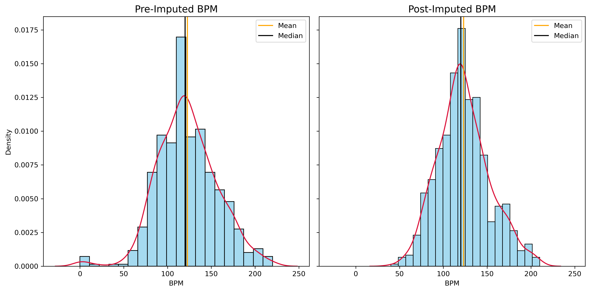
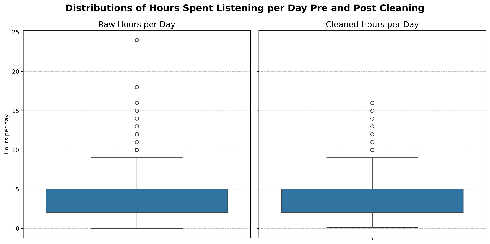
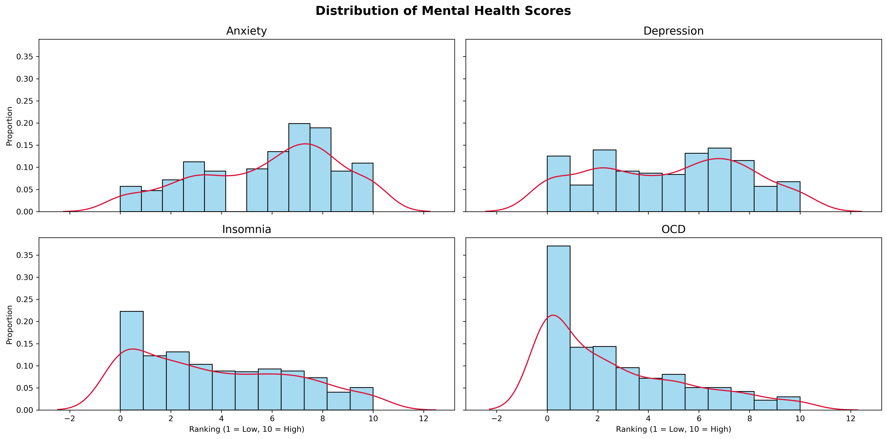
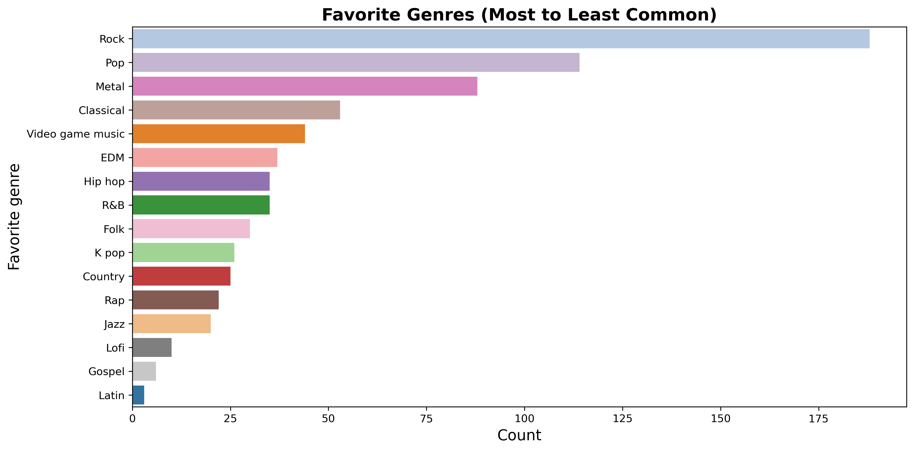
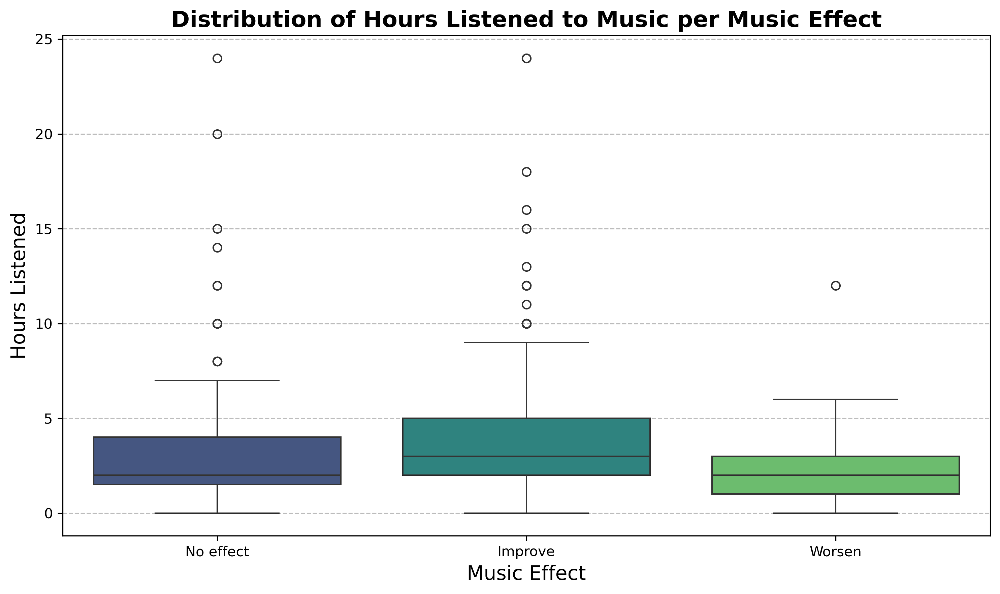
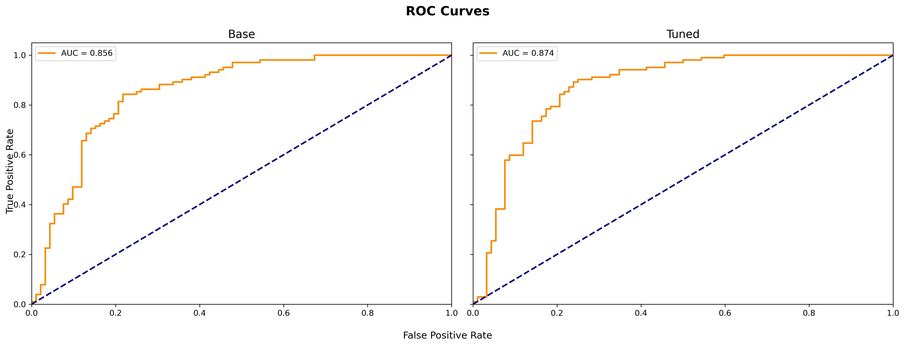

# 🎧 Music & Mental Health: Predictive Analysis of Emotional Outcomes

**Author:** \[Arsen Jamkotchian]  
**Project Type:** Data Science Portfolio  
**Directory Structure:** [cookiecutter-data-science](https://drivendata.github.io/cookiecutter-data-science/)

## 📘 Project Overview

This project explores the relationship between music listening habits and mental health outcomes using the [Music & Mental Health Survey Dataset](https://www.kaggle.com/datasets/catherinerasgaitis/mxmh-survey-results). Specifically, the goal is to **predict whether listening to music led to an improvement, worsening, or no effect on an individual's mental health**.

The project covers the full data science lifecycle:

* Data cleaning and preprocessing
* Exploratory data analysis (EDA)
* Feature engineering
* Model training and evaluation
* Interpretation and communication of results

## 🚀 How to Run
This project is fully managed with `make`. You'll need:
- `conda` (Miniconda or Anaconda)
- `make` (typically pre-installed on Unix/macOS; installable via WSL on Windows)

🔧 1. Clone the repository
```bash
git clone https://github.com/ajamkotc/music_mental_health_analysis.git
cd music_mental_health_analysis
```
📈 2. Run the full pipeline
```bash
make build_model
```
🧪 3. Run tests (optional)
```bash
make test
```
🧹 4. Format code and lint (optional)
```bash
make format   # Auto-fix and format code
make lint     # Check code style
```

## 📂 Repository Structure

This repository follows the [cookiecutter-data-science](https://drivendata.github.io/cookiecutter-data-science/) standard:

```
├── data
│   ├── external        # Raw external data (e.g., original CSVs)
│   ├── interim         # Intermediate data that has been transformed
│   ├── processed       # Cleaned data ready for modeling
│   └── raw             # Original, immutable data dump
│
├── docs                # Documentation and report files
│
├── models              # Trained and serialized models, model predictions
│
├── notebooks           # Jupyter notebooks for exploration and modeling
│
├── references          # Data dictionaries, references, and external literature
│
├── reports
│   └── figures         # Generated graphics and plots
│
├── music_and_mental_health_survey_analysis
|   ├── config          # Config variables
|   ├── utils           # Utility functions
│   ├── dataset         # Data loading
|   ├── cleaning        # Data cleaning scripts
│   ├── features        # Feature engineering scripts
|   ├── sampling        # Over and undersampling scripts
│   └── modeling
|   |   |── train       # Trains model
|   |   └── predict     # Generate predictions
│
├── .gitignore
├── README.md
├── requirements.txt
└── setup.py
```

## 🧠 Problem Statement

Can we predict the impact of music listening on an individual's mental health?
Target variable:

* **improved** (binary):

  * `0`
  * `1`

This is a **binary classification problem**.

## 📊 Dataset

**Source:** [Music & Mental Health Survey Dataset on Kaggle](https://www.kaggle.com/datasets/catherinerasgaitis/mxmh-survey-results)

**Key Features:**

* Demographic information (age)
* Music listening habits (genres, hours per day, whether they listen while studying/working)
* Mental health indicators and perceived effects of music

**Target Variable (engineered):**

* Derived from survey responses regarding whether music has improved, worsened, or had no effect on mental health.

## 🔍 Project Goals

* Clean and preprocess messy survey data
* Understand relationships between listening habits and mental health outcomes
* Train and evaluate classification models (e.g., Random Forest, Gradient Boosting, Logistic Regression)
* Communicate findings visually and narratively

## 🛠️ Technologies Used

* Python (Pandas, scikit-learn, scipy, Matplotlib, Seaborn)
* Jupyter Notebooks
* cookiecutter-data-science project structure
* Kaggle dataset integration

## 🧼 Data Cleaning

To prepare the dataset for analysis and modeling, a comprehensive data cleaning pipeline was developed and validated. The cleaning process ensures high data quality and supports accurate modeling.

### Key Cleaning Steps

* ✅ **Removed static columns**: Dropped columns where all values were identical, contributing no useful variance.

* ✅ **Handled missing values**:

  * *Mental health indicators* (e.g., OCD) were left as-is if missingness was minimal.
  * *BPM* (beats per minute) was imputed using **KNN imputation**, leveraging similarities across other features to estimate realistic values.

* ✅ **Converted column types**: Ensured appropriate types (e.g., integers for ordinal scores, categorical for survey responses) to facilitate encoding and modeling.

* ✅ **Outlier removal**:

  * Detected and removed extreme outliers in continuous features (e.g., respondents claiming to listen to music 24 hours/day or BPM values in the millions).
  * Focused particularly on `Hours per day` and `BPM` fields using interquartile range (IQR) thresholds.

### Example Outcomes

* ✅ Cleaned BPM values followed a **normal-like distribution** centered around realistic human tempos (see figure below).

* ✅ Extreme `hours per day` listening values were capped or excluded to preserve interpretability and modeling integrity.


## 📊 Exploratory Data Analysis (EDA) Summary

Our initial exploration of the *Music & Mental Health* dataset (Kaggle) focused on understanding the structure, distribution, and quality of the data. Key goals included identifying missing values, characterizing variable types, and uncovering initial patterns between music preferences and mental health indicators.

### 🧾 Dataset Overview

* **736 survey responses** collected, with a mix of categorical and ordinal variables.
* Minimal missingness overall; *BPM* (beats per minute) had \~15% missing, requiring imputation.
* Majority of features are `object`-typed, indicating a need for conversion and encoding prior to modeling.

### 🧠 Mental Health Features

* The variables `Anxiety`, `Depression`, `Insomnia`, and `OCD` are scored on a **0–10 scale**, treated as ordinal.
* Distribution appears normal-ish, with the majority of scores clustering between 2 and 8.


### 🧍 Demographics & Listening Habits

* **Average age**: \~25 years old, mostly between 18–27.
* **Hours of music per day**: mean ≈ 3.7 hours, but some extreme outliers (e.g., 0 and 24 hours).
* **BPM** contains several extreme outliers (millions+) that were cleaned during preprocessing.

### 🎵 Genre Listening Frequency

* Frequency categories span from *Never* to *Very frequently* for each genre.
* **Rock**, **Pop**, and **Metal** are the most commonly listened-to genres.
* **Gospel**, **Latin**, and **K-Pop** were most often marked *Never*.
* Only **Rock** and **Pop** had higher "Very frequently" responses than "Never".



### 🎹 Instrumental and Listening Style

* Most respondents are **not instrumentalists or composers**.
* There’s a strong positive correlation between being an instrumentalist and being a composer.
* \~80% listen to music while working.

* \~70% describe their listening style as **exploratory**, suggesting openness to new music.

## 📊 Model Performance
| Model                        | Accuracy | Precision | Recall | F1 Score | ROC_AUC |
| ---------------------------- | -------- | --------- | -------|----------|-------- |
| Gradient Boosting Classifier | 0.79     | 0.77      | 0.83   | 0.79     |  0.86   |
|




## 📌 Future Work

* Experiment with NLP on open-ended responses
* Explore genre-specific effects in more depth
* Create a web dashboard for interactive data exploration

## 📎 Links

* [LinkedIn](https://www.linkedin.com/in/arsenjamkotchian/)
* [GitHub](https://www.github.com/ajamkotc/)

## 📄 License

This project is for educational and portfolio purposes. Dataset copyright belongs to the original creators.
